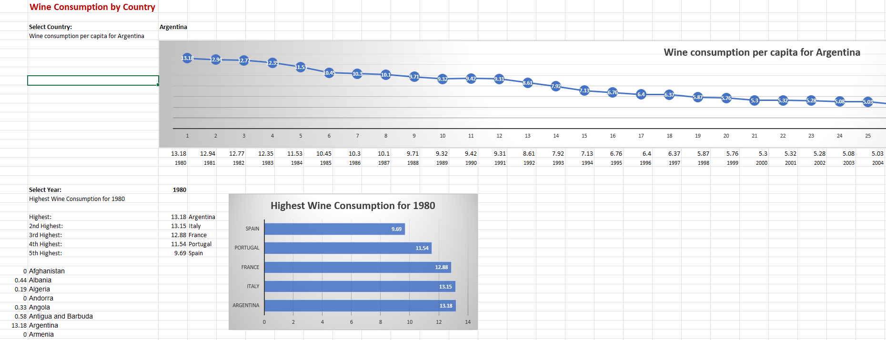

# Wine_Dashboard_Excel_Project

## Description

The wine dashboard project utilizes and demonstrates Excel's capabilities of converting large volumes of data in tabular format to a usable dashboard, complete with graphs and drop-down menu selelctions.

The input data contains the country name, the year and the wine per capita in litres.The dashboard shows the amount of wine consumed by different countries over time along with the top 5 countries by wine consumption for a particular year.The country and year can be selected from the respective drop-down lists.

## Concepts used

1. **Functions**
   1. CONCAT - to combine text values from two different columns
   2. VLOOKUP - to extract value located in a different sheet
   3. IFERROR - for error handling
   4. LARGE - to get the top 5 based on a certain metric
2. **Drop-Down Lists** - for creating a dynamic interactive feature to select specific value out of the given values (for country and year)
3. **Charts** - for visualizing the required data
4. **Absolute References**

## Final Result

